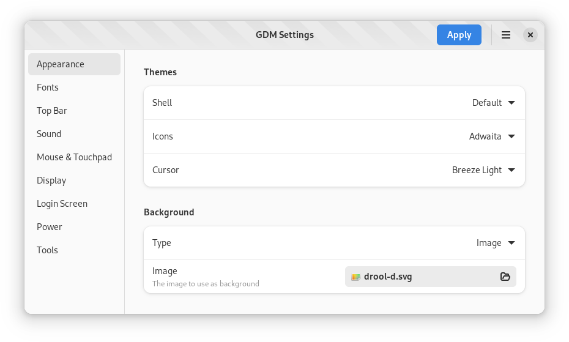
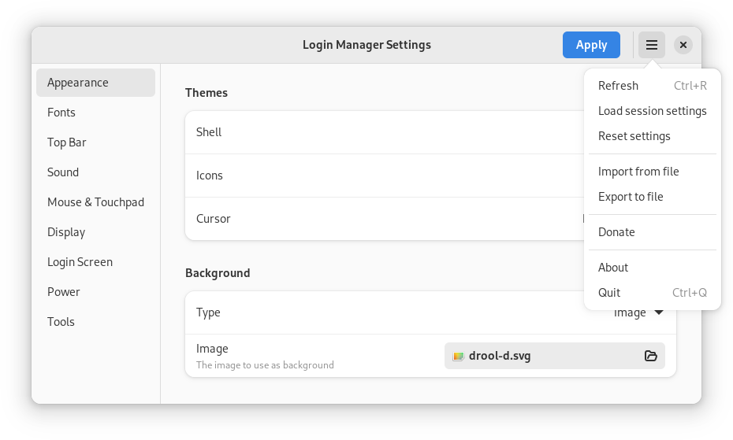
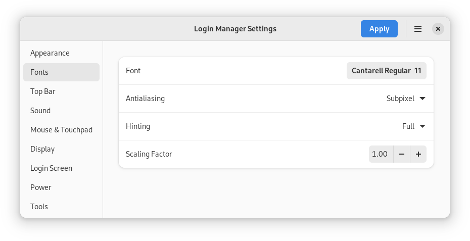
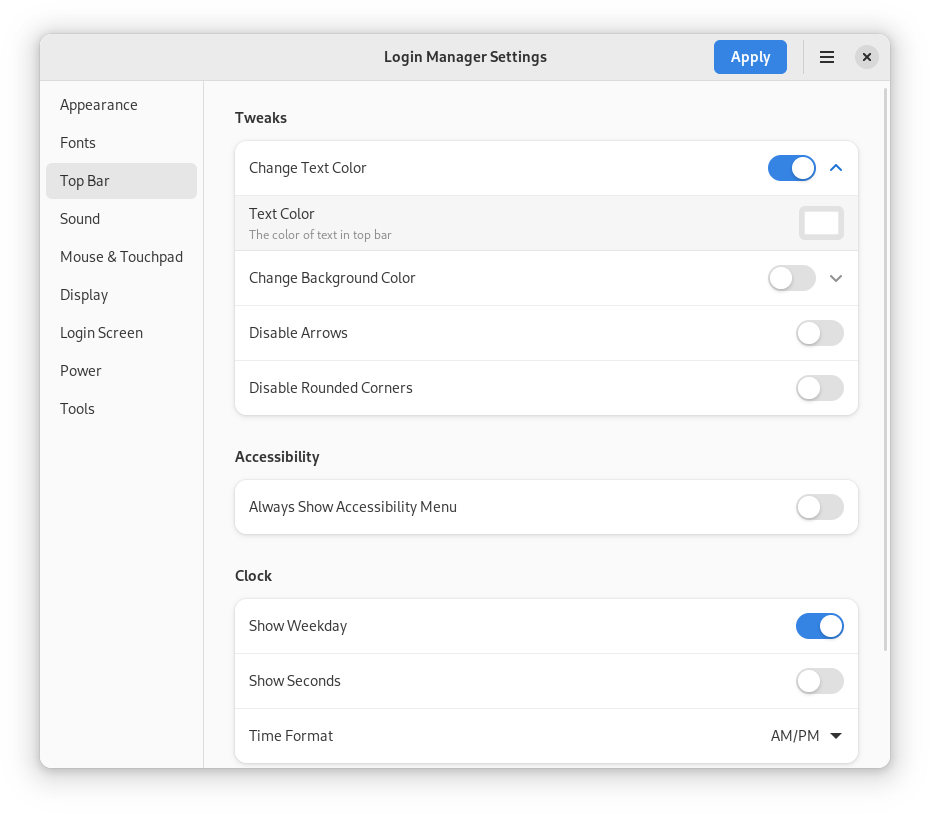
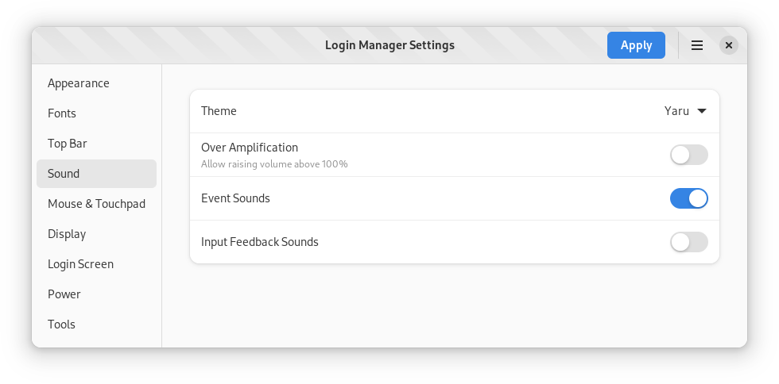
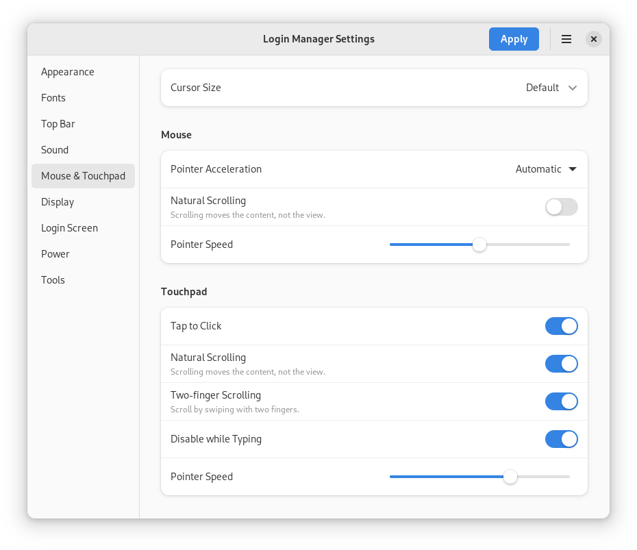
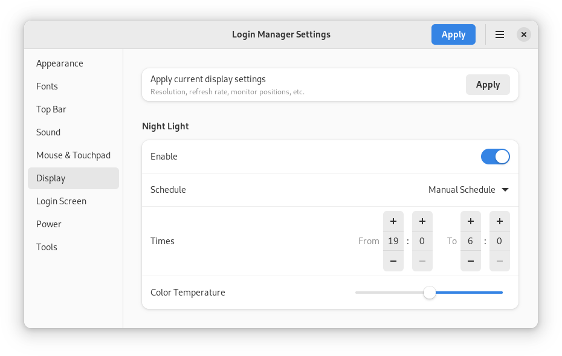
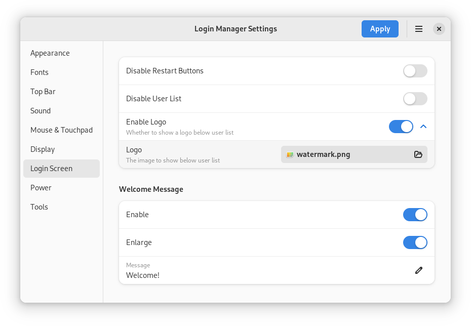
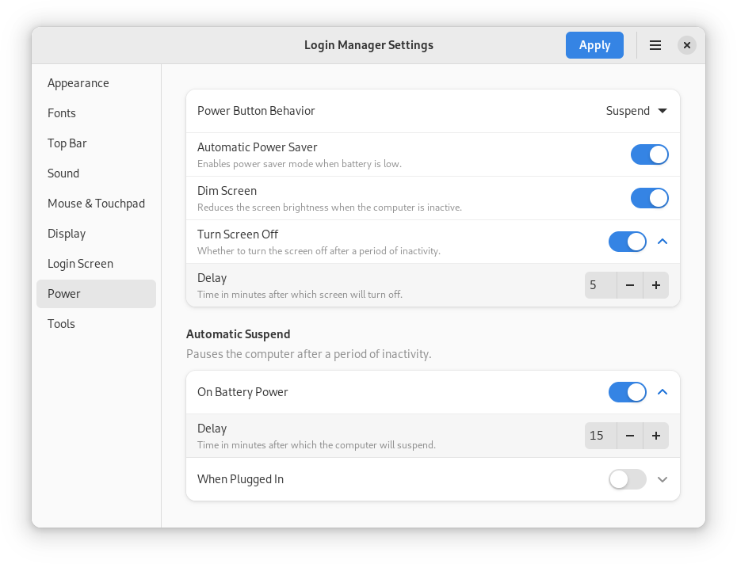
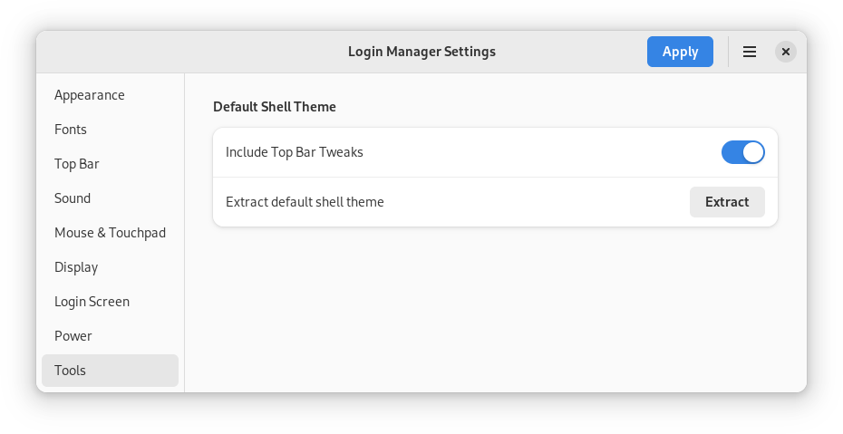

# Screenshots

<picture>
  <source srcset="dark/default.png" media="(prefers-color-scheme: dark)">
  
</picture>

<picture>
  <source srcset="dark/tall-sidebar.png" media="(prefers-color-scheme: dark)">
  
</picture>

<picture>
  <source srcset="dark/tall-content.png" media="(prefers-color-scheme: dark)">
  
</picture>

<picture>
  <source srcset="dark/appearance.png" media="(prefers-color-scheme: dark)">
  
</picture>

<picture>
  <source srcset="dark/menu.png" media="(prefers-color-scheme: dark)">
  
</picture>

<picture>
  <source srcset="dark/fonts.png" media="(prefers-color-scheme: dark)">
  
</picture>

<picture>
  <source srcset="dark/top-bar.png" media="(prefers-color-scheme: dark)">
  
</picture>

<picture>
  <source srcset="dark/sound.png" media="(prefers-color-scheme: dark)">
  
</picture>

<picture>
  <source srcset="dark/mouse-and-touchpad.png" media="(prefers-color-scheme: dark)">
  
</picture>

<picture>
  <source srcset="dark/display.png" media="(prefers-color-scheme: dark)">
  
</picture>

<picture>
  <source srcset="dark/login-screen.png" media="(prefers-color-scheme: dark)">
  
</picture>

<picture>
  <source srcset="dark/power.png" media="(prefers-color-scheme: dark)">
  
</picture>

<picture>
  <source srcset="dark/tools.png" media="(prefers-color-scheme: dark)">
  
</picture>
