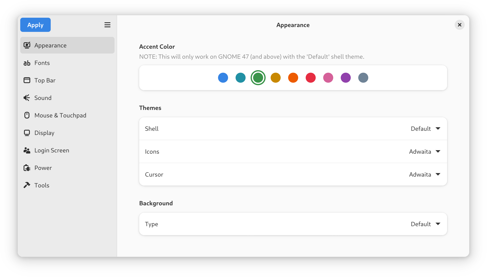
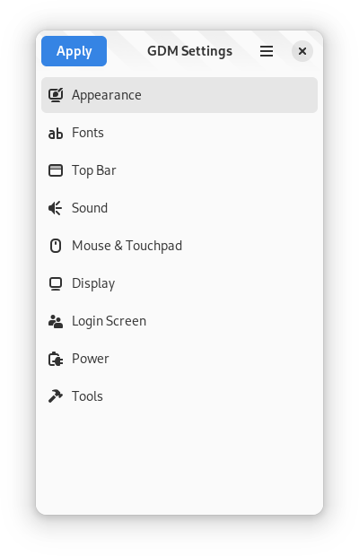
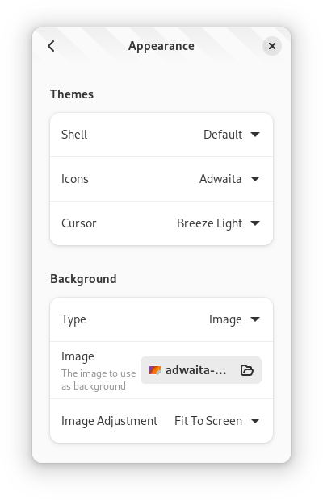

# Screenshots

<picture>
  <source srcset="dark/default.png" media="(prefers-color-scheme: dark)">
  
</picture>

<picture>
  <source srcset="dark/tall-sidebar.png" media="(prefers-color-scheme: dark)">
  
</picture>

<picture>
  <source srcset="dark/tall-content.png" media="(prefers-color-scheme: dark)">
  
</picture>
