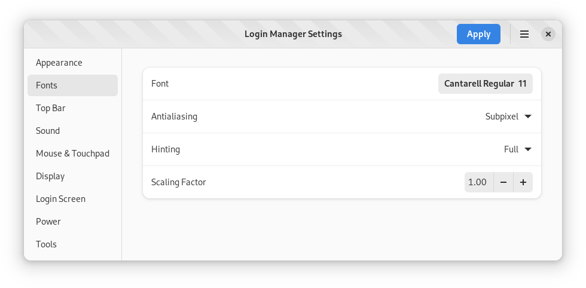
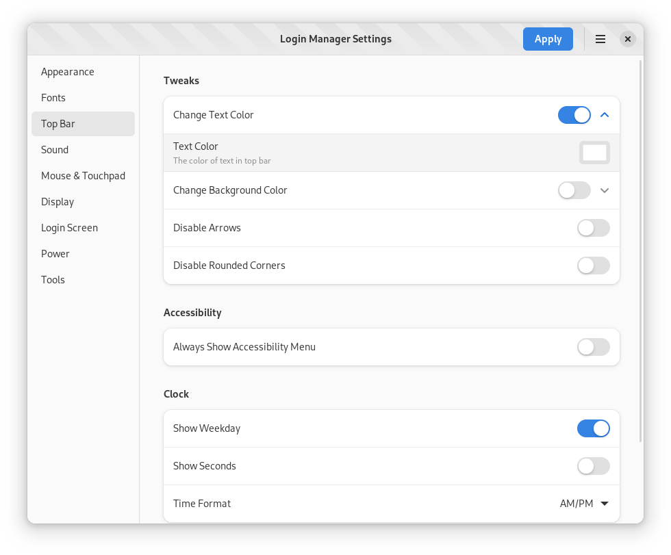
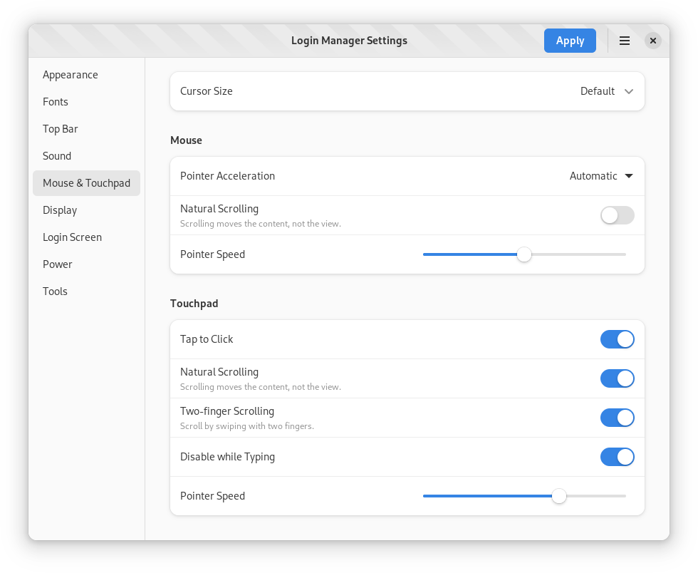

# Screenshots

<picture>
  <source srcset="dark/screenshot-1.png" media="(prefers-color-scheme: dark)">
  
</picture>

<picture>
  <source srcset="dark/screenshot-2.png" media="(prefers-color-scheme: dark)">
  
</picture>

<picture>
  <source srcset="dark/screenshot-3.png" media="(prefers-color-scheme: dark)">
  
</picture>

<picture>
  <source srcset="dark/screenshot-4.png" media="(prefers-color-scheme: dark)">
  
</picture>

<picture>
  <source srcset="dark/screenshot-5.png" media="(prefers-color-scheme: dark)">
  
</picture>

<picture>
  <source srcset="dark/screenshot-6.png" media="(prefers-color-scheme: dark)">
  
</picture>

<picture>
  <source srcset="dark/screenshot-7.png" media="(prefers-color-scheme: dark)">
  
</picture>

<picture>
  <source srcset="dark/screenshot-8.png" media="(prefers-color-scheme: dark)">
  
</picture>

<picture>
  <source srcset="dark/screenshot-9.png" media="(prefers-color-scheme: dark)">
  
</picture>
